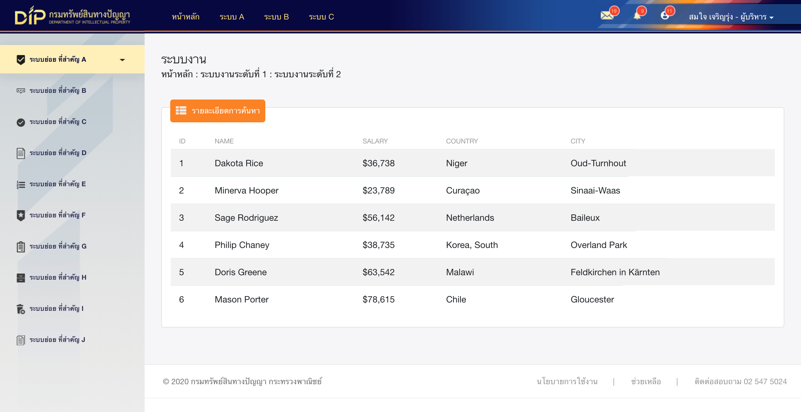

# DIP Backend

ระบบหลังบ้านโครงการ DIP เขียนด้วยภาษา **HTML CSS Javascript** และใช้ **Bootstrap 4** เป็นโครงหลัก

**ตัวอย่างหน้า**



## Technical:
- HTML, CSS(Compile From Scss), Javascript
- Bootstrap 4


## Quick start
รายละเอียดที่สำคัญอื่น ๆ
### Install
ดาวน์โหลดเป็นไฟล์ zip ไปใช้งานได้เลย

### directories and files:
เมื่อได้โฟลเดอร์มาแล้ว สามารถนำโฟล์เดอร์ที่ชื่อ **examples** ไปใช้งานต่อได้เลย ด้านล่างจะแสดงโฟลเดอร์ **ที่เกี่ยวข้อง** ที่อยู่ภายใน (อื่นๆ ที่อยู่นอกเหนือจากที่บอก เป็นไฟล์สำหรับการพัฒนา theme)

```
docs
├── assets
│   ├── css
│   │   └── custom-style.css
│   ├── fonts
│   ├── img
│   │   └── dip
│   ├── js
│   │   └── innerstyle.js
│   └── sass
├── index.html
└── login.html
```

### How to

จะมีบางส่วนที่ถูกเขียนเติมเข้าไปด้วยวิธี *pseudoStyle* ใน javascript เลยต้องมีการเพิ่มภาพ หรือกำหนดสีต่างๆ ใน Attribute data ของ div ดังนี้ อยู่ที่ **div.sidebar**