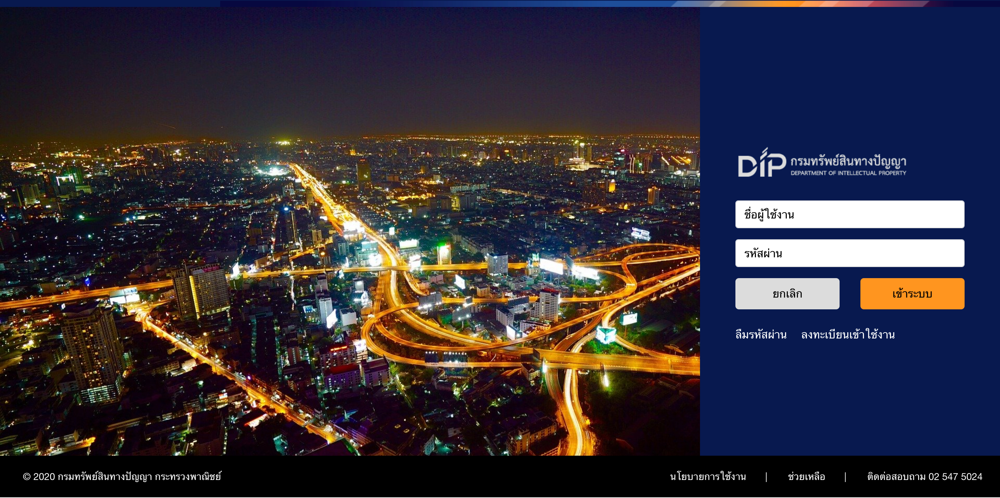
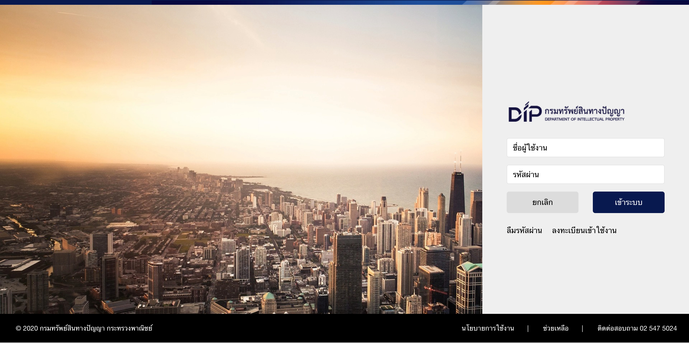
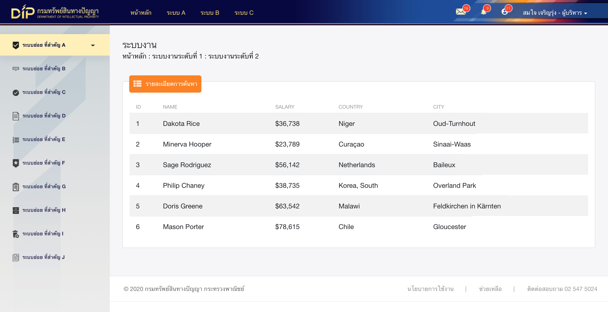

# DIP Backend

ระบบหลังบ้านโครงการ DIP เขียนด้วยภาษา **HTML CSS Javascript** และใช้ **Bootstrap 4** เป็นโครงหลัก

**ตัวอย่าง page**

[Go to project on Github](https://charine.github.io/dip-backend/)

**ตัวอย่างหน้า**







## Technical:
- HTML, CSS(Compile From Scss), Javascript
- Bootstrap 4
- Bootstrap Table


## Quick start
รายละเอียดที่สำคัญอื่น ๆ
### Install
ดาวน์โหลดเป็นไฟล์ zip ไปใช้งานได้เลย

ถ้าต้องการ run project โดยใช้ node.js ช่วย ให้ติดตั้งตามนี้ผ่าน command line
```
// == ขั้นตอนติดตั้ง gulp ให้ generate file sass -> css และ liverelode ==
//npm install -g gulp <- ถ้าที่เครื่องยังไม่เคยติดตั้ง gulp ต้องติดตั้งแบบ global ก่อน
//npm install --save-dev gulp
//npm install node-sass gulp-sass --save-dev
//npm install browser-sync gulp --save-dev
```

**คำสั่งพื้นฐาน**
- เปิด project
```
gulp

//or

gulp serve
```
- build file style
```
gulp sass
```

### directories and files
เมื่อได้โฟลเดอร์มาแล้ว สามารถนำโฟล์เดอร์ที่ชื่อ **docs** ไปใช้งานต่อได้เลย ด้านล่างจะแสดงโฟลเดอร์ **ที่เกี่ยวข้อง** ที่อยู่ภายใน (อื่นๆ ที่อยู่นอกเหนือจากที่บอก เป็นไฟล์สำหรับการพัฒนา theme)

```
docs
├── assets
│   ├── css
│   │   └── custom-style.css
│   ├── fonts
│   ├── img
│   │   └── dip
│   ├── js
│   │   └── innerstyle.js
│   └── sass
├── index.html
├── index_light.html
└── home.html
```

### How to

จะมีบางส่วนที่ถูกเขียนเติมเข้าไปด้วยวิธี *pseudoStyle* ใน javascript เลยต้องมีการเพิ่มภาพ หรือกำหนดสีต่างๆ ใน Attribute data ของ div อยู่ที่ **div.sidebar** ดังนี้


**home.html**
```
<div class="sidebar" id="sidebar" data-color="#fff0ba" data-side-color="#d1dde2" data-background-color="#0a0c40" data-side-image="../assets/img/dip/side.png" data-image="../assets/img/dip/side.png" data-image-navbar="../assets/img/dip/gradian_right.png">
```

1. `data-color` : String | สีปุ่มที่ active
2. `data-side-color` : String | (ไม่ได้ใช้แล้ว)
3. `data-background-color` : String | สีพื้นหลัง Navbar
4. `data-side-image` : String(URL) | ภาพพื้นหลัง Side Menu
5. `data-image` : String(URL) | (ไม่ได้ แต่ลบไม่ได้เพราะเป็น default ระบบ)
6. `data-image-navbar` : String(URL) | ภาพพื้นหลังที่จะซ้อนอยู่บน Navbar


**index.html & index_light.html**
```
<div id="listyle" class="wrapper dip-login" data-login-style="dark">
```

`data-login-style` : String | เลือก theme ของหน้า login ระหว่าง " dark | light "